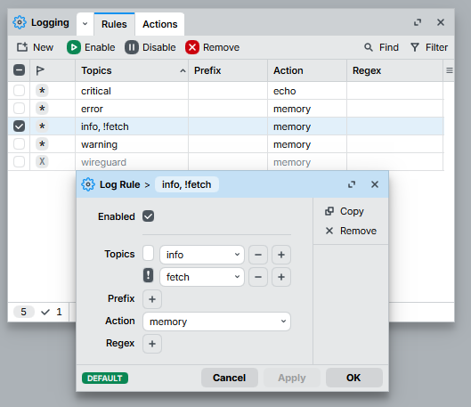

# Monitoring WAN ports

This page complements [2-WAN failover setup](2-wan-dhcp-failover-rec-route) and enables monitoring of the WAN interfaces.
10.8.0.1 is an IP address of the Wireguard server, where there is [Uptime Kuma](https://uptimekuma.org) monitoring server set up at port 3001.

The idea is that a router monitors its WAN interfaces and notifies the monitoring server over the private monitoring WG tunnel.
First we need to create a push monitor in Uptime Kuma via its web interface:

<p></p>

Our device needs to periodically ping that **Push URL** for status updates. In this example, we create 2 named scripts, `kuma-wan1-heartbeat` and `kuma-wan2-heartbeat`:

```
/system script add name=kuma-wan1-heartbeat dont-require-permissions=yes source= {{
:local host "8.8.8.8"
:local intf "ether1"
:local count "5"
:local pushUrl "http://10.8.0.1:3001/api/push/<APIKEY>"
:local result

:if ([:len $intf] > 0) do={
    :set result [/ping $host interface=$intf count=$count as-value]
} else={
    :set result [/ping $host count=$count as-value]
}
:local avg 0
:local success 0
:foreach r in=$result do={
    :if ($r->"time" != nil  && ($r->"status") = nil) do={
        :set avg ($avg + ($r->"time"))
        :set success ($success + 1)
    }
}
:put $result
:put "Successful attempts: $success / $count";

:if ($success > 0) do={
    :set avg ($avg / $success)
    :put "Average successful time: $avg";
    :local t [:tostr $avg]; # "00:02:01.123456"

    # split into hours, minutes, seconds+frac
    :local h [:tonum [:pick $t 0 2]]; #"00"
    :local m [:tonum [:pick $t 3 5]]; #"02"
    :local sfrac [:pick $t 6 [:len $t]]; #"01.123456"

    # split seconds and fractional part
    :local sec [:tonum [:pick $sfrac 0 2]]   ; #"01"  1
    :local frac [:pick $sfrac 3 [:len $sfrac]]  ; #"123456"

    # calculate total ms
    :local ms (($h*3600 + $m*60 + $sec) * 1000 + [:tonum [:pick $frac 0 3]]); # ((02 * 60) + 1) *1000) + 123 -> "121123"

    /tool fetch url=("$pushUrl?status=up&msg=OK&ping=$ms") output=none;
} else={
    /tool fetch url=("$pushUrl?status=down&msg=FAIL") output=none;
}
}}

/system script add name=kuma-wan2-heartbeat dont-require-permissions=yes source= {{
:local host "8.8.4.4"
:local intf "ether2"
:local count "5"
:local pushUrl "http://10.8.0.1:3001/api/push/<APIKEY>"
:local result

:if ([:len $intf] > 0) do={
    :set result [/ping $host interface=$intf count=$count as-value]
} else={
    :set result [/ping $host count=$count as-value]
}
:local avg 0
:local success 0
:foreach r in=$result do={
    :if ($r->"time" != nil  && ($r->"status") = nil) do={
        :set avg ($avg + ($r->"time"))
        :set success ($success + 1)
    }
}
:put $result
:put "Successful attempts: $success / $count";

:if ($success > 0) do={
    :set avg ($avg / $success)
    :put "Average successful time: $avg";
    :local t [:tostr $avg]; # "00:02:01.123456"

    # split into hours, minutes, seconds+frac
    :local h [:tonum [:pick $t 0 2]]; #"00"
    :local m [:tonum [:pick $t 3 5]]; #"02"
    :local sfrac [:pick $t 6 [:len $t]]; #"01.123456"

    # split seconds and fractional part
    :local sec [:tonum [:pick $sfrac 0 2]]   ; #"01"  1
    :local frac [:pick $sfrac 3 [:len $sfrac]]  ; #"123456"

    # calculate total ms
    :local ms (($h*3600 + $m*60 + $sec) * 1000 + [:tonum [:pick $frac 0 3]]); # ((02 * 60) + 1) *1000) + 123 -> "121123"

    /tool fetch url=("$pushUrl?status=up&msg=OK&ping=$ms") output=none;
} else={
    /tool fetch url=("$pushUrl?status=down&msg=FAIL") output=none;
}
}}
```

Here we ping 8.8.8.8 via `ether1` WAN interface and 8.8.4.4 via `ether2` and then report the result to the URL.
Now we need to add two Netwatch rules, `WAN1-mon` and `WAN2-mon` to our Mikrotik to run the scripts:

```
/tool netwatch
add disabled=no host=8.8.8.8 interval=1m name=WAN1-mon \
    test-script=kuma-wan1-heartbeat type=simple up-script=""
add disabled=no host=8.8.4.4 interval=1m name=WAN2-mon \
    test-script=kuma-wan2-heartbeat type=simple up-script=""
```

Note, the interval. It's 1 minute which matches 60 seconds window the Uptime Kuma monitor expects to receive a heartbeat within.
Now, verify the Uptime Kuma web UI and check Mikrotik's log. If everything is configured correctly, in the log you'll a lot of messages like
> Download from 10.8.0.1 FINISHED

in `fetch, info` topic. To suppress them, add `!fetch` to your existing `info` logging rules:
<p></p>
